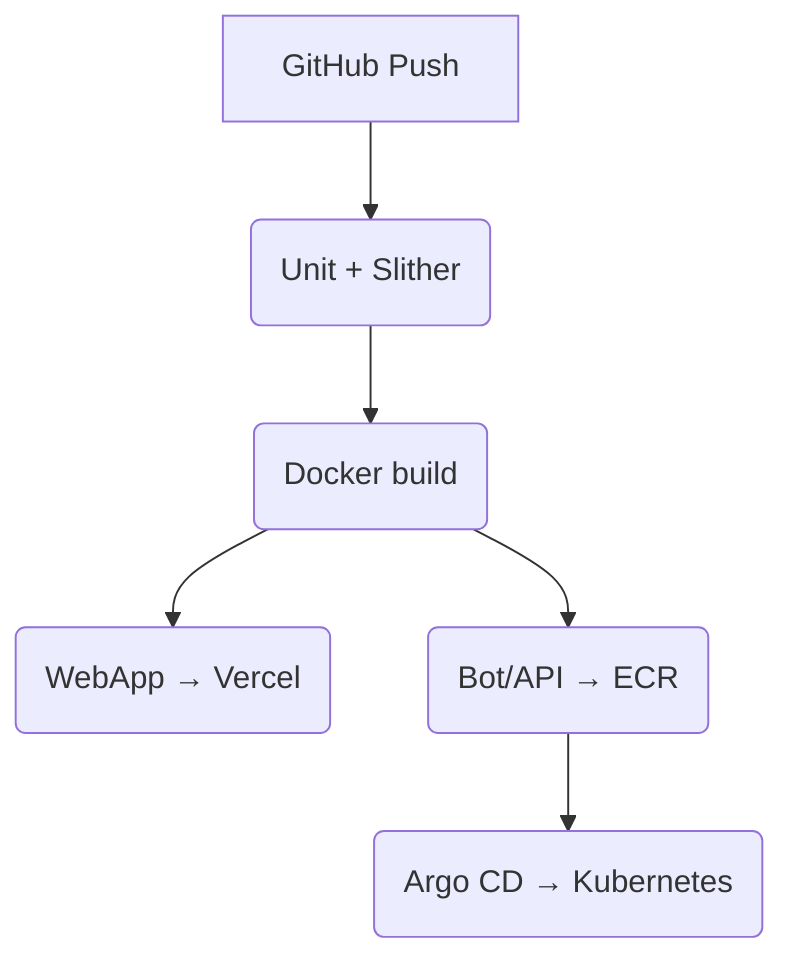

# **Universal Blockchain Charity Platform + Telegram Mini-App**  
**Документ:** `architecture.md`  
**Версия:** 2.1 • *08 июля 2025* (Europe/Paris)  

---

## Содержание
1. [Elevator Pitch](#elevator-pitch)  
2. [Глоссарий](#глоссарий)  
3. [UX-потоки](#ux-потоки)  
4. [Высокоуровневая схема](#высокоуровневая-схема)  
5. [Telegram-слой (aiogram)](#telegram-слой-aiogram)  
6. [Референс-стек](#референс-стек)  
7. [Смарт-контракты](#смарт-контракты)  
8. [Back-end & API](#back-end--api)  
9. [ML-платформа](#ml-платформа)  
10. [CI/CD & IaC](#cicd--iac)  
11. [Безопасность](#безопасность)  
12. [Roadmap](#roadmap)  
13. [Приложения](#приложения)  

---

## Elevator Pitch
*Создаём B2B2C-инфраструктуру, где каждое пожертвование фиксируется в Polygon PoS, а пользовательский интерфейс реализован как Telegram Mini-App внутри бота на **aiogram**. Донор делает пожертвование ≤ 30 секунд, получает NFT-квитанцию и видит live-дашборд с задержкой < 5 с.*

---

## Глоссарий
| Термин | Определение |
|--------|-------------|
| **aiogram** | Async-Python-framework для Telegram Bot API v6+ |
| **Mini-App** | Telegram WebApp, открываемый внутри чата |
| **Deep Link** | `https://t.me/<bot>?start=<payload>` |
| **TG Auth** | Проверка подписи `initData` из WebApp |
| **Safe** | Gnosis Safe (3-of-5 multi-sig) |
| **Campaign** | Контракт конкретной благотворительной кампании |
| **ProofNFT** | ERC-721-квитанция донора |

---

## UX-потоки
### A. Донор
1. `/start` → бот присылает кнопку **«Каталог кампаний»**.  
2. Кнопка открывает Mini-App.  
3. Донор выбирает кампанию → в WebView открывается WalletConnect v3 Modal.  
4. Подписывает `donate()`; спустя ≤ 5 с бот отправляет:
   * ссылку на Polygonscan  
   * изображение NFT-квитанции  
   * кнопку «Открыть дашборд».

### B. Фонд
*Через режим ORG внутри Mini-App:* создаёт кампанию, загружает KPI-документы (IPFS), ожидает multi-sig-подписей.

### C. Аудитор  
*Получает deep-link `/audit <campaignId>` → открывает дашборд, подписывает Safe-Tx.*

---

## Высокоуровневая схема
```
Telegram Client
 ├─ aiogram-бот (FastAPI webhook)
 │    /start /donate /help
 │         ▲  answerWebAppQuery
 │         └─ WebApp button
 └─────────────╥─────────────────────────────
               ║  initData (+ hash)
               ▼
        API Gateway (NestJS GraphQL)
               │ subscriptions (WS)
               ▼
        Event-Processor  ◄─ on-chain WS
               │ Kafka "donations"
               ▼
      ML-Inference (TorchServe gRPC)
               │ risk_score
               ▼
    ComplianceOracle (EVM-контракт)
               ▲
               │ RPC/WebSocket
          Polygon PoS Mainnet
```

---

## Telegram-слой (aiogram)

### 1. Структура проекта
```
bot/
 ├─ main.py           # FastAPI + aiogram webhook
 ├─ keyboards.py      # Reply/Inline keyboards
 ├─ callbacks.py      # WebAppData & inline handlers
 ├─ middlewares/
 ├─ routers/
 └─ settings.py       # pydantic-BaseSettings
```

### 2. main.py (сокращено)
```python
from fastapi import FastAPI
from aiogram import Bot, Dispatcher, types
from aiogram.webhook.aiohttp_server import SimpleRequestHandler, setup_application
from settings import Settings

cfg = Settings()                                 # BOT_TOKEN, WEBAPP_URL, WEBHOOK_PATH
bot = Bot(token=cfg.BOT_TOKEN, parse_mode="HTML")
dp  = Dispatcher()

@dp.message(commands=["start"])
async def cmd_start(msg: types.Message):
    kb = types.ReplyKeyboardMarkup(resize_keyboard=True)
    kb.add(types.KeyboardButton(
        text="Каталог кампаний",
        web_app=types.WebAppInfo(url=cfg.WEBAPP_URL)
    ))
    await msg.answer("Добро пожаловать! 👇", reply_markup=kb)

app = FastAPI()
SimpleRequestHandler(dp, bot).register(app, path=cfg.WEBHOOK_PATH)
setup_application(app, dp, bot, cfg.WEBHOOK_PATH)
```

### 3. WebApp (auth & WalletConnect)
```js
import WebApp from '@twa-dev/sdk';

WebApp.ready();                                            // сообщаем Telegram
const resp = await fetch('/tg/login', {
  method: 'POST',
  headers: { 'Content-Type': 'application/json' },
  body: JSON.stringify({ initData: WebApp.initData })
});
const { token } = await resp.json();                       // JWT
// далее — GraphQL запросы с Authorization: Bearer <token>
```

### 4. Handler WebAppData → бот
```python
from aiogram import F, Router
import json
router = Router()

@router.message(F.web_app_data)
async def on_webapp_data(msg: types.Message):
    payload = json.loads(msg.web_app_data.data)            # {txHash, amount,…}
    await msg.answer(
        f"✅ Спасибо за пожертвование!\n"
        f"Транзакция: <a href='https://polygonscan.com/tx/{payload['txHash']}'>"
        f"{payload['txHash'][:12]}…</a>"
    )
```

### 5. Деплой бота
* Контейнер `aiogram-bot` (см. Dockerfile).  
* HTTPS-Webhook `/tg/webhook` с заголовком `X-Telegram-Bot-Api-Secret-Token`.  
* Helm-chart указывает секцию `ingress` и `env`.

---

## Референс-стек
| Слой | Технологии | Почему |
|------|------------|--------|
| **Bot** | **aiogram 3.5**, FastAPI, uvicorn | Async, FSM, WebAppData |
| **Mini-App** | Next.js 14, React 18, Zustand, Tailwind | Поддержка Telegram WebApp |
| **TG-Auth** | `@twa-dev/verify` + FastAPI dep | Проверка подписи `initData` |
| **Back-end** | Node 20 + NestJS GraphQL | Typed, subscriptions |
| **Blockchain** | Polygon PoS (Solidity 0.8) | Низкие комиссии |
| **Wallet** | WalletConnect v3 Modal | Работает в WebView |
| **ML** | Kafka • Feast • TorchServe | near-RT risk-score |
| **CI/CD** | GH-Actions → Docker → Helm → Argo CD | GitOps |
| **DB** | RDS PostgreSQL 15 | ACID |
| **Cache/Queue** | Redis 7 (BullMQ) | Rate-limit, jobs |

---

## Смарт-контракты
```
DonationFactory
 ├─ Campaign (UUPS proxy)
 │   ├─ donate()
 │   ├─ withdrawMilestone()
 │   └─ refund()
 ├─ ComplianceOracle
 ├─ ProofNFT  (ERC-721)
 └─ PlatformToken (ERC-20, optional)
```
*Upgrade-контроль через Safe (3-of-5).*

---

## Back-end & API

### REST — Telegram Auth
```http
POST /tg/login
Content-Type: application/json
{
  "initData": "<hash=...>"
}
→ 200 OK
{
  "token": "<jwt>",
  "user": { "id": "uuid", "tgId": 123456789 }
}
```

### GraphQL — билд транзакции
```graphql
mutation BuildDonateTx($input: DonateInput!){
  donateTx(input: $input){
    to
    data
    value
    gasLimit
  }
}
```

---

## ML-платформа
| Use-case | Model | Trigger | Output |
|----------|-------|---------|--------|
| Fraud detection | Isolation Forest | Kafka `donations` | `risk_score` |
| KPI forecast | XGBoost | Cron 1 h | `success_prob` |
| Donor clustering | k-means + UMAP | Nightly batch | `cluster_id` |

Инференс → `ComplianceOracle.setStatus(donor, level)`  
(0 – OK, 1 – warning, 2 – block).

---

## CI/CD & IaC


*Terraform управляет VPC, EKS, RDS, S3, CloudFront.*

---

## Безопасность
| Область | Меры |
|---------|------|
| TG Auth | Сервер проверяет `initData` hash |
| API | JWT (HS256), Redis rate-limit 10 req/5 s |
| Контракты | Unit tests ≥ 90 %, Slither, MythX, внеш. аудит |
| Secrets | Vault KV + k8s CSI |
| WebApp | CSP `default-src 'self' https://walletconnect.com` |

---

## Roadmap
| Sprint (2 нед) | Deliverable | KPI |
|----------------|-------------|-----|
| **S0** | aiogram skeleton + webhook | deploy < 30 мин |
| **S1** | `/start` + Mini-App open | TTFT < 2 с |
| **S2** | Donate E2E (Mumbai) | success > 95 % |
| **S3** | KYC + ML risk | FPR < 10 % |
| **S4** | Milestone payout | Safe-Tx TAT < 2 мин |
| **S5** | Public Beta (Mainnet) | uptime 99.5 % |

---

## Приложения

### `.env` (bot)
```dotenv
BOT_TOKEN=123456:ABC-DEF_ghIklmNOPQ
WEBAPP_URL=https://charity.webapp.tg
WEBHOOK_PATH=/tg/webhook
WEBHOOK_SECRET=supersecret
```

### Dockerfile (`bot/`)
```dockerfile
FROM python:3.12-slim
WORKDIR /app
COPY pyproject.toml poetry.lock ./
RUN pip install poetry && poetry install --no-root
COPY bot/ bot/
CMD ["uvicorn", "bot.main:app", "--host", "0.0.0.0", "--port", "8080"]
```

### docker-compose (local dev)
```yaml
version: "3.9"
services:
  bot:
    build: ./bot
    env_file: .env
    ports: ["8080:8080"]
  api:
    build: ./api
    env_file: .env
    depends_on: [postgres, redis]
  web:
    build: ./web
    environment:
      NEXT_PUBLIC_TG_BOT="@CharityBot"
  postgres:
    image: postgres:15
    environment:
      POSTGRES_PASSWORD: pgpass
  redis:
    image: redis:7
```

### Пример WebAppData (JSON → бот)
```json
{
  "type": "donation",
  "txHash": "0xabc123...",
  "campaignId": "c0ffee",
  "amount": "25",
  "token": "USDC"
}
```

---

*© 2025 Core Engineering Team. Все права защищены.*
